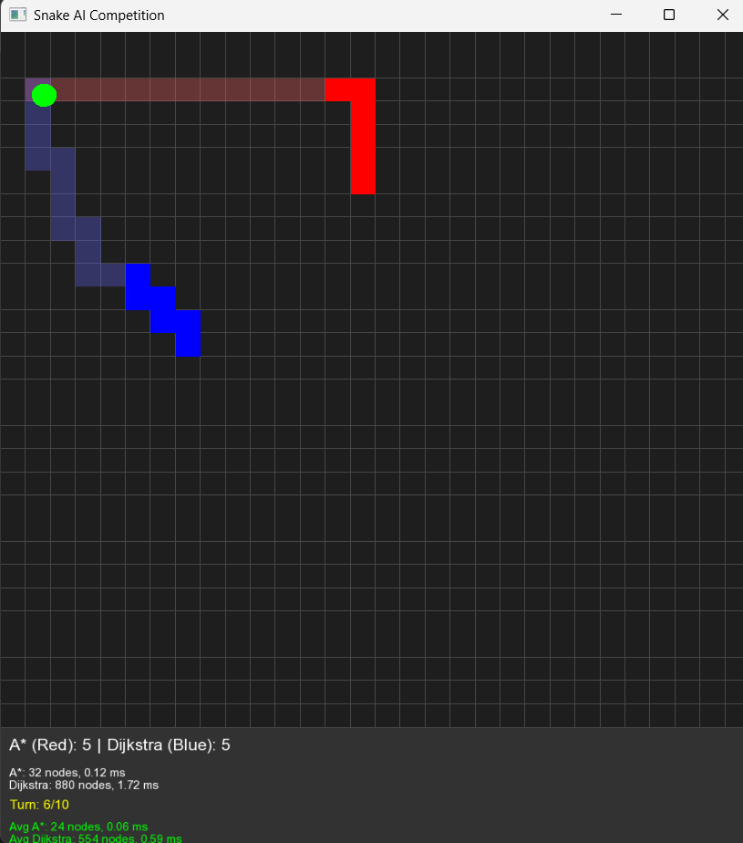

# 🐍 A* vs Dijkstra: Snake Pathfinding Speed Showdown

A visual simulation game using **SFML** that pits two intelligent snakes against each other—one powered by the **A\*** algorithm and the other by **Dijkstra’s** algorithm. The objective? Compete in multiple rounds to reach randomly placed food faster and smarter, while tracking performance metrics like computation time and nodes explored.

---

## 🖼️ Screenshots

| Gameplay |
|----------|
|  |

---

## 🎯 Objective

Compare the **efficiency** and **speed** of two popular pathfinding algorithms in a real-time environment:
- 🔴 **A\***: Uses heuristics (Manhattan distance) for faster decisions.
- 🔵 **Dijkstra**: Explores uniformly without any heuristic guidance.

Each snake attempts to reach food placed on the grid. The one that gets there first scores. After a fixed number of turns, their average performance is compared.

---

## 🧠 Algorithms Compared

| Feature           | A* Algorithm        | Dijkstra's Algorithm |
|------------------|---------------------|-----------------------|
| Heuristic Used   | Yes (Manhattan)     | No                    |
| Exploration Type | Informed Search     | Uniform Search        |
| Speed            | Generally Faster    | Slower for large maps|
| Implementation   | Priority Queue      | Priority Queue        |

---

## 🕹️ Gameplay Overview

- 🟩 A 30×30 grid.
- 🟢 Food spawns at random positions.
- 🐍 Two snakes (A\* and Dijkstra) race to the food using their respective pathfinding logic.
- 📊 Metrics tracked:
  - Nodes explored per turn
  - Computation time in milliseconds
  - Score (number of times snake reaches food first)

---

## 📦 Features

- 🔁 **10 turns of competition** between the algorithms.
- 📈 **Real-time performance metrics** shown per turn.
- 🧮 **Average stats** displayed at the end of the game.
- 🔁 Press `R` to restart the competition.
- ❌ Press `ESC` to quit.

---

## 🧰 Requirements

- C++17 or higher
- [SFML 2.5+](https://www.sfml-dev.org/)
- A font file (`arial.ttf`) placed in the project directory or at `C:\Windows\Fonts\arial.ttf`

---

## 🚀 How to Run

1. **Install SFML** using your package manager or from the official site.
2. **Compile the game**:

   ```bash
   g++ -std=c++17 main.cpp -o path_game -lsfml-graphics -lsfml-window -lsfml-system
